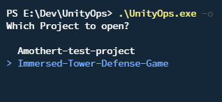

# UnityOps

UnityOps is a command-line application designed to streamline your Unity development workflow. It offers functionalities to easily locate Unity Editors and Projects, as well as swiftly launch other essential software tools you use in your daily development tasks.

## Features

- **Effortless Project Launching:** Seamlessly open Unity projects directly from the command line. UnityOps eliminates the need for manual searching and navigation, allowing you to dive straight into your projects with a single command.

- **Enhanced Workflow Integration(Coming Soon):** Beyond Unity, UnityOps extends its functionality to streamline your entire development workflow. It enables you to effortlessly launch other essential software tools integral to your development process, all with a single command.

## Why Use UnityOps?

UnityOps is designed for those seeking to bypass the manual process of individually launching every application. Instead, with just one command, you can effortlessly open all the tools essential for your daily development workflow.

## Getting Started

To start using UnityOps, follow these simple steps:

1. **Installation:** Download and install UnityOps on your system.
2. **Configuration:** You **MUST** run `UnityOps -config` then `UnityOps -find` upon you the first time.
3. **Usage:** `UnityOps -open`, displays a selectable list of projects found that you can open.
   

**Here are some Arguments** 

- `config` Initiate the configuration process. 
- `-o or -open` Displays a selectable list of projects found that you can open. 
- `-f or -find` Locate and display all discovered projects and editors along with their version numbers and the number of projects associated with each editor. 
- `-d or -debug` Enables debugging mode 
- `-h or -help` Shows a table of available commands 

## Contributing

UnityOps is an open-source project, and contributions are welcome! If you have ideas for new features, improvements, or bug fixes, feel free to submit a pull request or open an issue on our GitHub repository.
