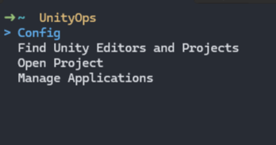
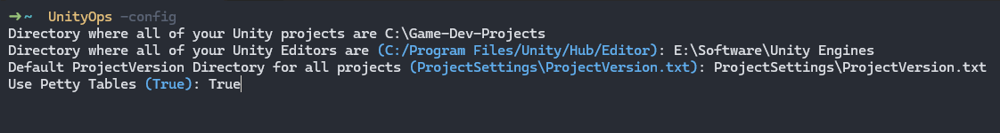
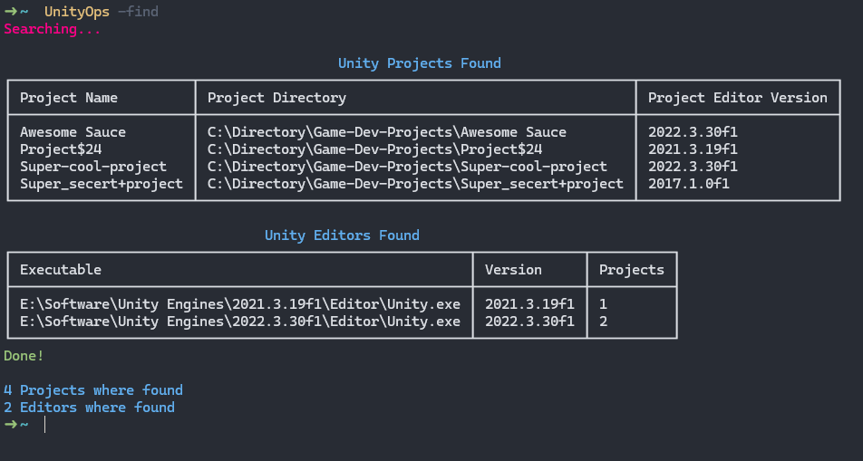
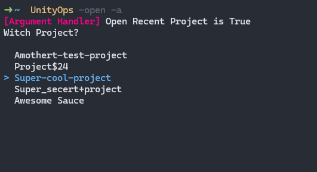
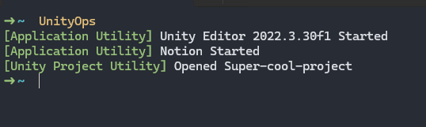
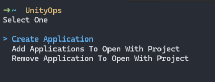
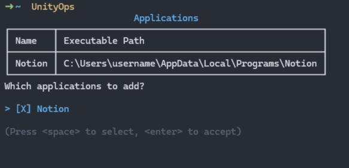
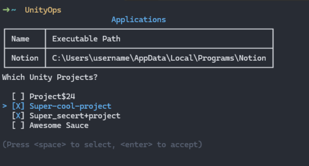

# UnityOps

UnityOps is a command-line tool to streamline your Unity development workflow. It opens Unity projects along with any
specified applications that you assign to launch alongside the project.

___

## Installing

1. Download the zip from [Releases](https://github.com/Izurezy/UnityOps/releases) or build it manually (see below).
2. Unzip the file and add the extracted folder to your system environment variables.

### Building

1. Clone the project.
2. Run `dotnet publish -r <RID> --self-contained` within the cloned directory:
    - Replace `<RID>` with your specific Runtime Identifier (RID). You can find a list of known
      RIDs [here](https://learn.microsoft.com/en-us/dotnet/core/rid-catalog#known-rids), such as `win-x64` for Windows
      or `linux-x64` for Linux.
3. After the build completes, navigate to the publishing directory (usually located within the `bin/Release/net8.0`
   folder)
   and add the folder containing the built files to your system environment variables.

___

## Usage

**You MUST run `UnityOps -config` before using UnityOps.**

**Config/Settings File in install directory. e.g.**
`C:/<path-to-UnityOps-directory>/UnityOps/Settings.json`

###### **.Lnk extension isn't supported**

### Arguments

- `-config`: Shows an interactive configurator.
- `-d` | `-debug`: Enables debugging.
- `-f` | `-find`: Looks for Unity Projects and Editors.
- `-p` | `-petty`: Toggles the usage of Spectre.Console tables.
- `-o` | `-open`: Opens a Unity Project or the most recent project if toggled on.
- `-a` | `-auto`: Toggles whether `-o` | `-open` should open the most recent project.
- `-h` | `-help`: Shows command line help.

___

## Debugging Color Table

- `blue`: **Point of Something**
- `deeppink1`: **Information**
- `yellow`: **Warning**
- `red`: **Error**
- `green`: **Success**

---

## Images

#### Main menu

#### Config process

#### Finding Projects & Editors

#### Project Selection & toggle open recent project

#### Opening application & project

#### Application menu

#### Adding applications to open with a project

